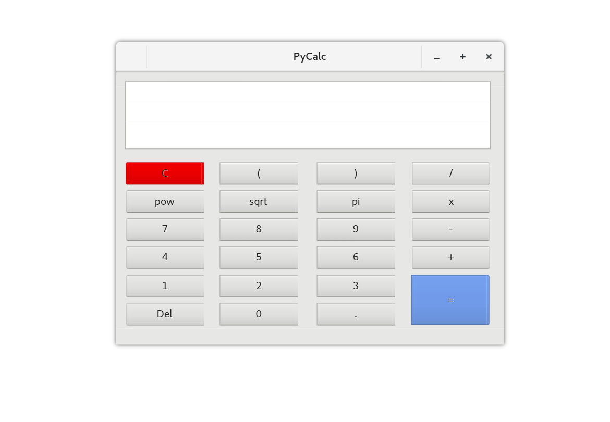

# Python and PyQt6: Building a GUI Desktop Calculator (PyCalc) #

PyCalc is a sample calculator implemented using Python 3 and with a [PyQt6](https://www.riverbankcomputing.com/static/Docs/PyQt6/introduction.html) GUI. Fundamentally, PyCalc implements basic math operations, such as; division, multiplication, addition, and subtraction.

PyCalc is an example of how to build a Python + PyQt6 GUI application using the Model-View-Controller (MVC) pattern. It was created by following the tutorial and article at RealPython, titled "[Python and PyQt: Building a GUI Desktop Calculator](https://realpython.com/python-and-pyqt-building-a-gui-desktop-calculator/)".

## Folder Content ##

The current folder, `materials-pyqt-calculator/`, hosts two subfolders:

1. `docs/` should contain the documentation for pycalc
2. `pycalc/` stores the code and related resources for your PyQt Calculator app.

## Screenshot ##



## Requirements ##

For PyCalc to work, you need to have [Python](https://www.python.org) >= 3.6.1. Then you need to install the PyQt6 library. You can do this by using `pip` in a Python virtual environment:

```console
$ python -m venv devenv
$ source devenv/bin/activate
$ python -m pip install pyqt6
```

After these commands have finished, you can run PyCalc as described in the next section.

## How to Run PyCalc ##

To run PyCalc from your system's command line or terminal, execute the following command:

```console
$ python pycalc.py
```

After running this command, you'll get PyCalc running on your machine. If you choose to edit the application for whatever reason, you may also wish to run it in editable mode from your virtual environment, so you can see the changes you have made right away. To do that, run the following command:

```sh
(devenv) $ pip install -e .
```

Run this from the project directory and it will automatically pick pycalc to install in editable mode.


## How to Use PyCalc ##

To use PyCalc, just enter a valid math expression using your mouse and then press `Enter` or click the `=` button to get the result.

## About the Author ##

PyCalc is originally developed by Leodanis Pozo Ramos is a **self-taught Python Developer, and [content creator](https://realpython.com/team/lpozoramos/)** at Real Python. It is edited by Phumelela Mdluli while learning from or using RealPython to learn.

## License ##

This project is distributed under the GPL license. See `LICENSE` for more information.

## Resources ##

+ [PyQt Docs](https://doc.qt.io/qtforpython-6/)

+ [Qt for Python Examples](https://doc.qt.io/qtforpython-6/examples/index.html)

+ [Riverbank Computing PyQt6 Reference](https://www.riverbankcomputing.com/static/Docs/PyQt6/)

+ [GNU General Public License](https://www.gnu.org/licenses/gpl-3.0.en.html)

